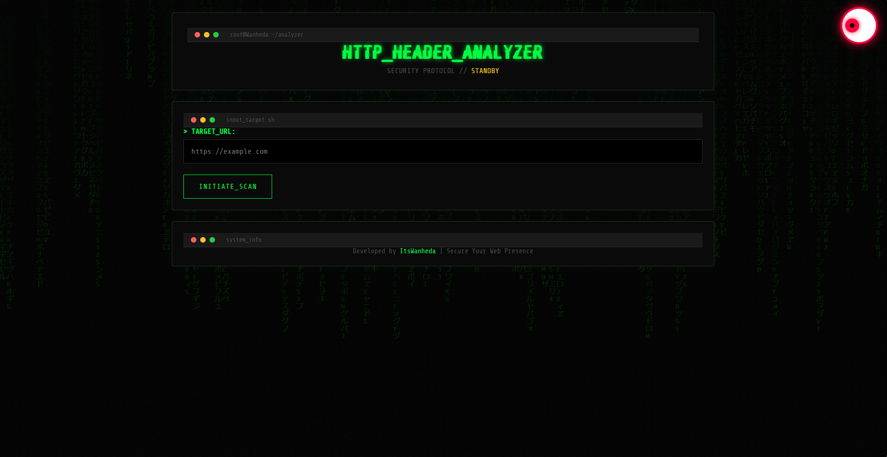

# 🔒 HTTP Header Analyzer

[](https://go.dev/)
[](LICENSE)
[]()

A powerful, open-source web application built with **Go (Golang)** that analyzes HTTP headers, TLS configurations, and redirect chains to assess website security. Features a stunning **Cyberpunk/Hacker-themed UI** with real-time analysis.

Developed by **ItsWanheda**.

---

## ✨ Features

-   **Security Header Analysis**: Checks for critical headers like HSTS, CSP, X-Frame-Options, etc.
-   **TLS/SSL Inspection**: Identifies TLS versions, cipher suites, and certificate validity.
-   **Redirect Chain Tracking**: Visualizes the full redirect path from HTTP to HTTPS.
-   **Security Scoring**: Calculates a 0-100 score and letter grade (A+ to F).
-   **SSRF Protection**: Prevents analysis of private/internal IP addresses.
-   **Cyberpunk UI**: Modern, glassy, hacker-themed interface with matrix background and interactive eye.
-   **REST API**: Fully functional JSON API for programmatic integration.

---

## 🚀 Quick Start

### Prerequisites

-   [Go](https://golang.org/dl/) (version 1.21 or higher)
-   Git

### Installation

1.  **Clone the repository:**
    ```bash
    git clone https://github.com/itswanheda7737/http-header-analyzer.git
    cd http-header-analyzer
    ```

2.  **Install dependencies:**
    ```bash
    go mod tidy
    ```

3.  **Run the server:**
    ```bash
    go run cmd/server/main.go
    ```

4.  **Open your browser:**
    Navigate to `http://localhost:8080`

---

## 📂 Project Structure

```text
http-header-analyzer/
├── .gitignore              # Ignore build artifacts, OS files, etc.
├── LICENSE                 # MIT License file
├── README.md               # Project documentation
├── go.mod                  # Go module definition
├── go.sum                  # Dependency checksums
├── screenshots/            # Images for README
├── cmd/                    # Application entry points
│   └── server/
│       └── main.go         # The main executable
├── internal/               # Private application code
│   ├── analyzer/           # Core analysis logic
│   │   ├── analyzer.go
│   │   ├── security.go
│   │   ├── tls.go
│   │   └── redirects.go
│   ├── api/                # HTTP handlers
│   │   └── handlers.go
│   ├── models/             # Data structures
│   │   └── result.go
│   └── validation/         # URL validation logic
│       └── url.go
└── web/                    # Frontend assets
    ├── templates/
    │   └── index.html
    └── static/
        ├── style.css
        └── app.js
```
---

## 🛠️ API Documentation

### Analyze Endpoint

**POST** `/api/analyze`

**Request Body:**
```json
{
  "url": "https://example.com"
}

Response (200 OK):

{
  "url": "https://example.com",
  "timestamp": "2026-06-07T19:47:16Z",
  "security_headers": [
    {
      "name": "Strict-Transport-Security",
      "value": "max-age=31536000; includeSubDomains",
      "present": true,
      "status": "pass",
      "message": ""
    }
  ],
  "tls": {
    "version": "TLS 1.3",
    "cipher_suite": "TLS_AES_256_GCM_SHA384",
    "valid": true,
    "subject": "*.example.com",
    "issuer": "Let's Encrypt",
    "expires_at": "2027-01-01T00:00:00Z"
  },
  "redirects": [],
  "score": 95,
  "rating": "A"
}

Health Check Endpoint
GET /api/health
{
  "status": "healthy"
}

📸 Screenshots

### Main Interface


### Analysis Results


🤝 Contributing
Contributions are welcome! Please feel free to submit a Pull Request.

1.Fork the Project
2.Create your Feature Branch (git checkout -b feature/AmazingFeature)
3.Commit your Changes (git commit -m 'Add some AmazingFeature')
4.Push to the Branch (git push origin feature/AmazingFeature)
5.Open a Pull Request


📄 License
Distributed under the MIT License. See LICENSE for more information.

🙏 Acknowledgments
Gorilla Mux
Go Standard Library
