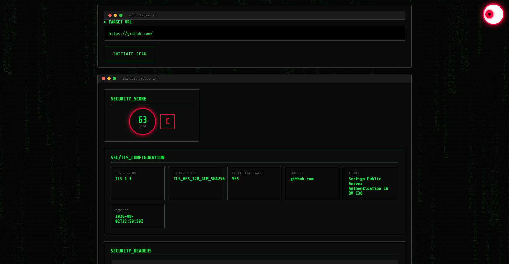
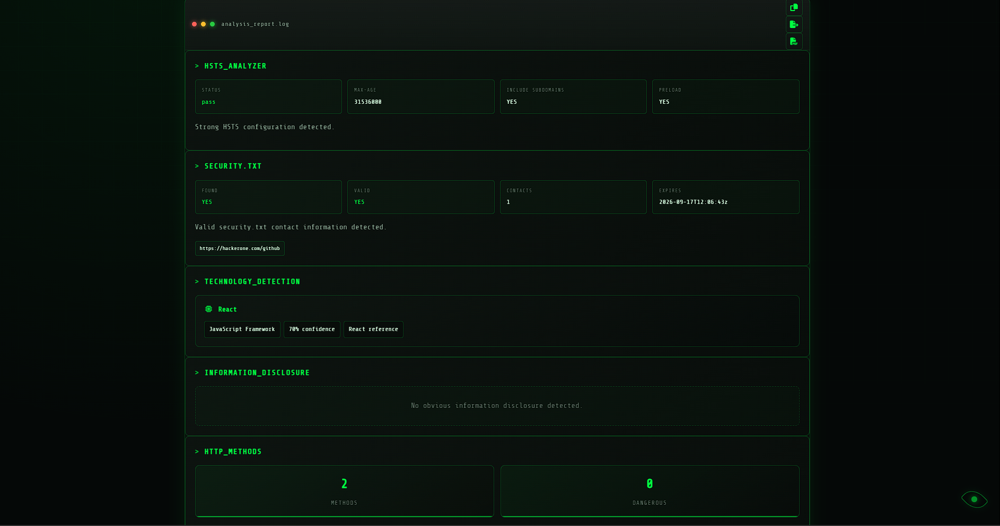
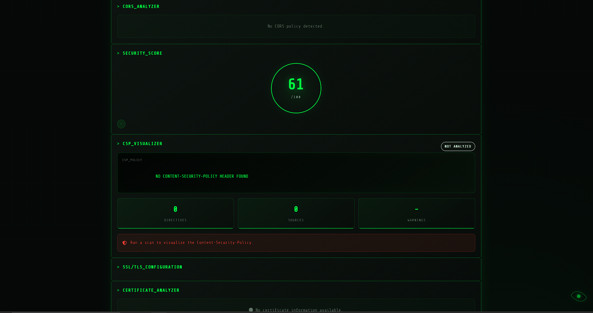

# 🔒 HTTP Header Analyzer


A security-focused HTTP header analysis tool built with **Go (Golang)**. It inspects HTTP response headers, TLS configurations, and redirect chains to help identify common web security issues and misconfigurations.

Developed by **ItsWanheda**.

---

## ✨ Features

### 🛡️ Security & Analysis Core
* **Security Header Analysis**: Deep inspection of CSP, HSTS, X-Frame, X-Content-Type, Referrer, and Permissions policies.
* **TLS/SSL Inspection**: Detects TLS versions, cipher suites, certificate metadata, and expiration status.
* **Redirect Chain Tracking**: Full path visualization from initial request to final destination.
* **Security Scoring**: Automated 0–100 scoring system with letter grades (A+ to F).
* **Built-in SSRF Protection**: Hardened against blind/non-blind SSRF by blocking localhost, private IP ranges, and internal network targets.

### 🎨 User Experience (UX)
* **Cyberpunk/Hacker Aesthetic**: Dark-themed, high-contrast UI designed for security enthusiasts.
* **Dark/Light Mode**: Smooth theme toggling for comfort during late-night analysis.
* **Responsive Design**: Fluid layout optimized for desktops, tablets, and mobile devices.
* **Interactive Feedback**: 
    * **One-Click Clipboard**: Instant JSON response copying.
    * **Pulsing Skeleton Loaders**: Smooth, professional loading states.
    * **Toast Notifications**: Non-intrusive status updates for alerts and operations.

### ⚙️ Integration
* **REST API**: JSON-based analysis endpoints and system health-check utilities.

---

## 🚀 Quick Start

### Prerequisites

* Go 1.21+
* Git

### Clone the Repository

```bash
git clone https://github.com/itswanheda7737/http-header-analyzer.git
cd http-header-analyzer
```

### Install Dependencies

```bash
go mod tidy
```

### Run the Application

```bash
go run cmd/server/main.go
```

### Open in Browser

```text
http://localhost:8080
```

---

## 📂 Project Structure

```text
http-header-analyzer/
├── cmd/
│   └── server/
│       └── main.go
│
├── internal/
│   ├── analyzer/
│   │   ├── analyzer.go
│   │   ├── security.go
│   │   ├── tls.go
│   │   └── redirects.go
│   │
│   ├── api/
│   │   └── handlers.go
│   │
│   ├── models/
│   │   └── result.go
│   │
│   └── validation/
│       └── url.go
│
├── web/
│   ├── templates/
│   │   └── index.html
│   │
│   └── static/
│       ├── style.css
│       └── app.js
│
├── go.mod
├── go.sum
└── README.md
```

---

## 🛠 API Documentation

### Analyze Target

**Endpoint**

```http
POST /api/analyze
```

### Request Body

```json
{
  "url": "https://example.com"
}
```

### Example Response

```json
{
  "url": "https://example.com",
  "timestamp": "2026-06-07T19:47:16Z",
  "security_headers": [
    {
      "name": "Strict-Transport-Security",
      "value": "max-age=31536000; includeSubDomains",
      "present": true,
      "status": "pass",
      "message": ""
    }
  ],
  "tls": {
    "version": "TLS 1.3",
    "cipher_suite": "TLS_AES_256_GCM_SHA384",
    "valid": true,
    "subject": "*.example.com",
    "issuer": "Let's Encrypt",
    "expires_at": "2027-01-01T00:00:00Z"
  },
  "redirects": [],
  "score": 95,
  "rating": "A"
}
```

---

### Health Check

**Endpoint**

```http
GET /api/health
```

### Response

```json
{
  "status": "healthy"
}
```

---

## 📸 Screenshots

### Main Interface


### Analysis Results







---

## 🤝 Contributing

Contributions, issues, and feature requests are welcome.

### Steps

1. Fork the repository
2. Create a feature branch

```bash
git checkout -b feature/my-feature
```

3. Commit your changes

```bash
git commit -m "Add my feature"
```

4. Push to your branch

```bash
git push origin feature/my-feature
```

5. Open a Pull Request

---

## 📄 License

Distributed under the MIT License.

See the `LICENSE` file for more information.

---

## 🙏 Acknowledgments

* Go Standard Library
* Gorilla Mux
* Open-source security community

---

## ⭐ Support

If you find this project useful, consider giving it a star on GitHub. It helps the project grow and reach more developers.
